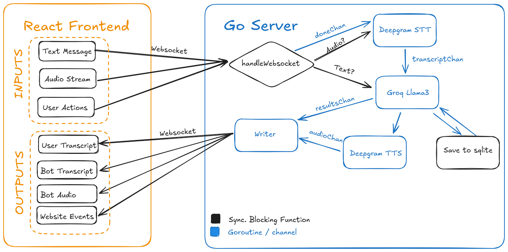

# Text & Audio UI Demo

A chatbot user interface that streams text and audio simultaneously between the user and the LLM.

## Tech stack
* React frontend
* Go backend
* Deepgram for speech-to-text (STT) and text-to-speech (TTS)
* Groq Llama 3.1 8B "instant" as the LLM

## Setting it up
After cloning the repo, you will need to make your own `.env` in `/server/.env` with your Groq and Deepgram API keys. See the example file for guidance.

# How it works

A single conversational turn follows this pattern:
1. As soon as the user presses space bar, audio is streamed from their microphone to the server in 200 ms slices.
2. Streamed audio is forwarded immediately to the Deepgram listening websocket.
3. As soon as the user releases space bar, a stop signal is raised, which causes two things:
    * A "Finalize" message is sent to the Deepgram listening websocket, which tells it to process its cache and return a transcript of whatever it has left
    * The data from Deepgram is collected into a single transcript string
4. The transcript string is combined with the last 6 messages in the conversation (which is stored in SQLite), and sent to Groq. Its response streamed into two channels:
    * One channel forwards streamed text to the client to show the bot's message as text
    * The other channel collects the streamed text and starts chunking it by sentence
5. As soon as there is at least one sentence chunked, that sentence is sent to the Deepgram TTS endpoint.
    * If the response from Groq is super short and fast, it will get chunked as one sentence and sent to Deepgram as a single API call.
6. Response audio from Deepgram TTS is sent to the client for playback.
7. Once all text has been received from Groq, it is collected and stored in SQLite to provide context for the next message.
